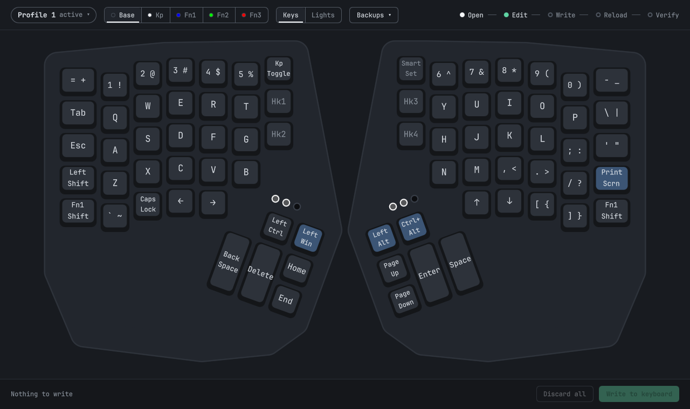
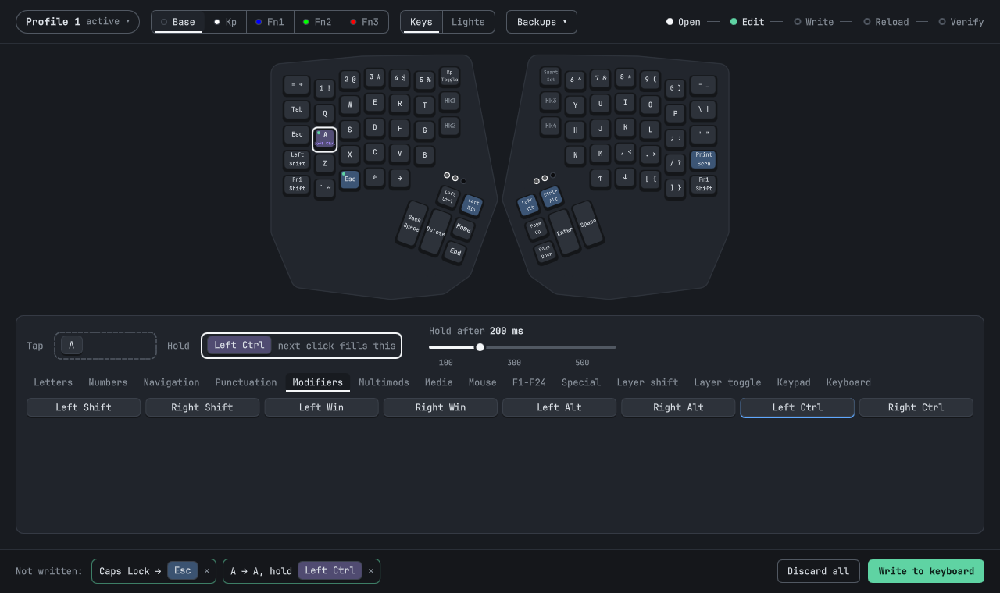
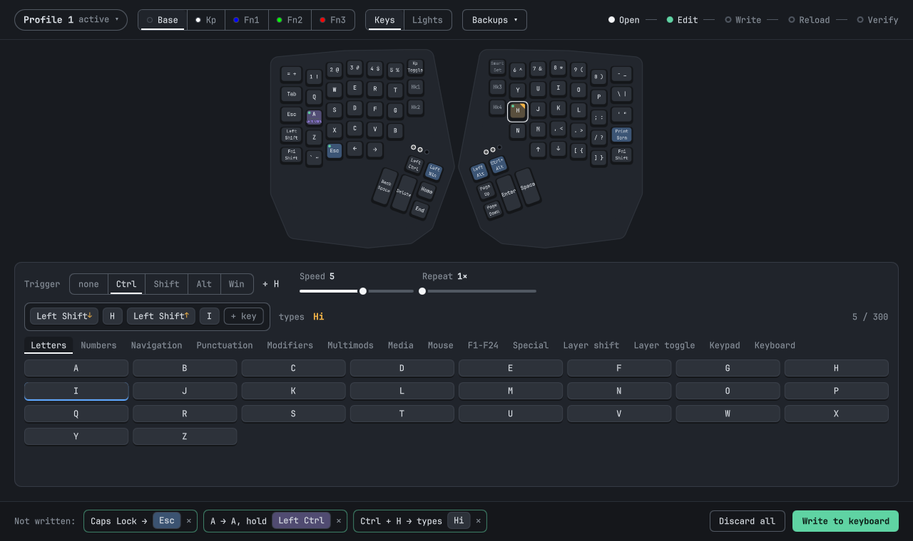
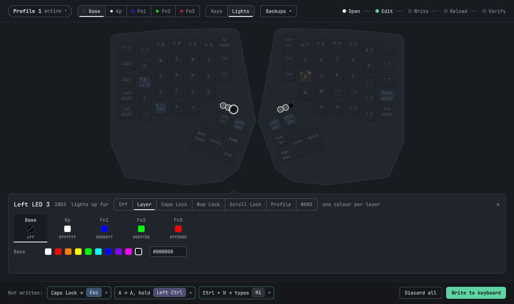
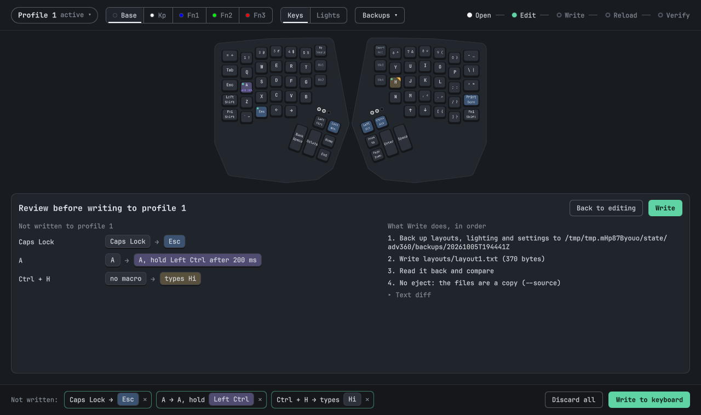
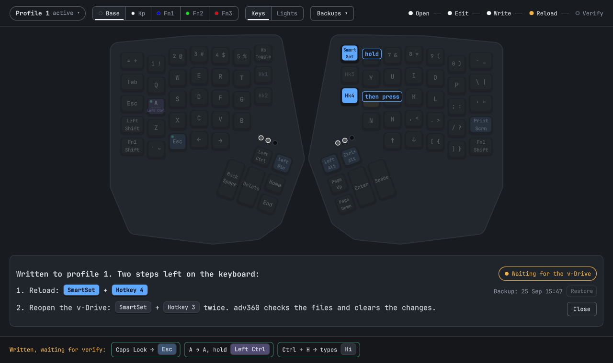

# adv360

A native Linux editor for the Kinesis Advantage360 with the SmartSet engine (the non-ZMK model).



Kinesis ships no Linux tool for this keyboard, and the official SmartSet App breaks under Wine. The keyboard keeps its whole configuration as small text files on its own USB volume, the v-Drive. `adv360` reads those files, draws them on a picture of your keyboard, lets you change keys, macros and LEDs, and writes them back safely.

## What you can do

**Remap a key.** Click a key, pick its new action from the tabs below (letters, modifiers, media, mouse, layer shifts…). Every change waits in the bottom bar until you write it.

**Tap & hold.** One key, two jobs: here `A` types `a` when tapped and acts as Left Ctrl when held for 200 ms.



**Macros.** Build a sequence of keystrokes on a trigger. Here `Ctrl + H` types `Hi`; the preview shows what the macro will type.



**LEDs.** Switch to *Lights* to choose what each indicator LED shows (layer, Caps Lock, Num Lock, profile…) and its colours.



**Layers and profiles.** The top bar switches between the 9 profiles and the 5 layers (Base, Keypad, Fn1–Fn3). The dot next to each layer is the colour its LED shows on the keyboard.

**Backups.** Every write starts with a full backup; the *Backups* menu restores any of them.

## Install (Omarchy)

```sh
git clone https://github.com/bengous/adv360 ~/Work/adv360
cd ~/Work/adv360 && ./install.sh
```

You need `bun` to build (`mise use -g bun`) and `quickshell` for the window. The script installs:

- the `adv360` command in `~/.local/bin/` and its files in `~/.local/share/adv360/`;
- an *Advantage360 editor* entry in the app launcher;
- an *Advantage360* row in the Omarchy menu.

It never edits your Hyprland config. It prints two optional extras for you to add yourself:

```lua
-- ~/.config/hypr/bindings.lua: open the editor with Super + Shift + K
o.bind("SUPER + SHIFT + K", "Advantage360 editor", "adv360 gui")
```

```sh
# a notification when the v-Drive opens, even with the editor closed
omarchy plugin add ~/Work/adv360 --enable
```

To update, `git pull` and run `./install.sh` again.

## Your first change

The keyboard decides when its v-Drive is open; only you can press its chords. The editor shows the next step at all times, in the top-right line *Open → Edit → Write → Reload → Verify*.

1. **Open the v-Drive.** Hold `SmartSet` and press `Hotkey 3`. The LEDs flash and the editor reads the files.
2. **Edit.** Run `adv360 gui` (or `Super + Shift + K`). Click keys, build macros, set LEDs. Nothing touches the keyboard yet.
3. **Review and write.** Click *Write to keyboard*. The review lists each change and every step the write will take.

   

4. **Reload.** After the write, the editor ejects the v-Drive and shows the chord to press: `SmartSet` + `Hotkey 4`.

   

5. **Verify.** Press `SmartSet` + `Hotkey 3` twice to reopen the v-Drive. The editor checks the files against what it wrote and clears the changes.

Try new ideas on a spare profile first (profile 9 is a good one): `SmartSet` + a digit switches profiles, and profile 1 is the one you type on every day.

## Why it is safe

- A full backup of `layouts/`, `lighting/` and `settings/` before every write, in `~/.local/state/adv360/backups/`.
- Each file is written to a temporary copy on the keyboard, synced, renamed into place, then read back and compared.
- It never writes `settings.txt` or the firmware, and never mounts the drive. The only drive command it runs is the eject.
- Files you did not change stay byte for byte the same. Actions it does not recognise are kept and shown as raw text.
- One write at a time. If the files look wrong after a reload, the editor says so and points at the backup to restore.

## From the terminal

Everything the window does is also a command, and every command prints JSON, so scripts and AI agents can drive the keyboard too.

```sh
adv360 vdrive status                      # is the v-Drive open, which profile is active, what to do next
adv360 session set-remap --profile 9 --layer base --pos caps --action esc
adv360 diff --profile 9                   # what will change
adv360 apply --profile 9                  # backup, write, read back, eject
# press SmartSet + Hotkey 4, then SmartSet + Hotkey 3 twice
adv360 verify
```

| Command | What it does |
|---|---|
| `adv360 gui` | opens the editor |
| `adv360 vdrive status` | drive state (`absent`, `mounted`, `ejected`, `busy-writing`, `corrupt-suspected`), active profile, firmware, and `next`: the chord or command to do next |
| `adv360 vdrive eject` | ejects the drive |
| `adv360 inspect [--profile N]` | every line of every layout and LED file, with warnings |
| `adv360 view --profile N --layer base\|kp\|fn1\|fn2\|fn3` | what each key does on that layer |
| `adv360 session set-remap\|set-taphold\|set-macro\|remove\|set-led\|load-file\|discard\|status --profile N …` | prepare changes without touching the keyboard; `adv360` alone lists the flags |
| `adv360 diff --profile N` | the pending changes as a text diff |
| `adv360 apply --profile N [--dry-run]` | writes the pending changes; the first line names every side effect |
| `adv360 verify` | after reload and reopen: `verified`, `unchanged` or `mismatch` |
| `adv360 backup` | a backup now |
| `adv360 restore <backup> --profile N` | prepares a restore; `apply` writes it |
| `adv360 watch` | one JSON line per drive change, a notification when it opens |

Add `--source DIR` (or `ADV360_SOURCE=DIR`) to any command to work on a copy of the files instead of the keyboard. Exit codes: `0` ok, `1` a named error (`{"error": …, "message": …}`), `2` bad usage. Full reference: [`docs/capabilities.md`](docs/capabilities.md).

## Requirements

| Tool | Used for | If it is missing |
|---|---|---|
| `bun` | building only | `install.sh` stops |
| `quickshell` | the editor window | `adv360 gui` says so; the commands still work |
| `lsblk` | finding the `ADV360` drive | error `lsblk-missing` |
| `udisksctl` | ejecting | error `udisksctl-missing`; the write is done, run `apply` again to retry the eject |
| `diff` (GNU) | `adv360 diff` | error `diff-failed` |
| `omarchy-notification-send` | notifications | a warning, nothing else |

## Status

Tested on a real Advantage360 (firmware 1.0.69) on 2026-09-13: a remap written to profile 9, reloaded and verified, then restored from the backup and verified again, with profile 1 untouched.

## Development

`bun run check` runs everything: format, lint, layer imports, types, tests, QML lint, shellcheck. To see the window without opening it on your desktop, `tools/gui-shot.sh <out-dir> tests/gui/<n>.shot` draws it on a hidden screen, drives it and saves screenshots; `tools/gui-shot.sh --teardown` removes that screen. The README images come from `tests/gui/readme.shot`. Vocabulary is in [`CONTEXT.md`](CONTEXT.md), project rules in [`AGENTS.md`](AGENTS.md).

## License

MIT, see [`LICENSE`](LICENSE). Independent project, not affiliated with or endorsed by Kinesis Corporation. Kinesis, Advantage360 and SmartSet are trademarks of Kinesis Corporation.
